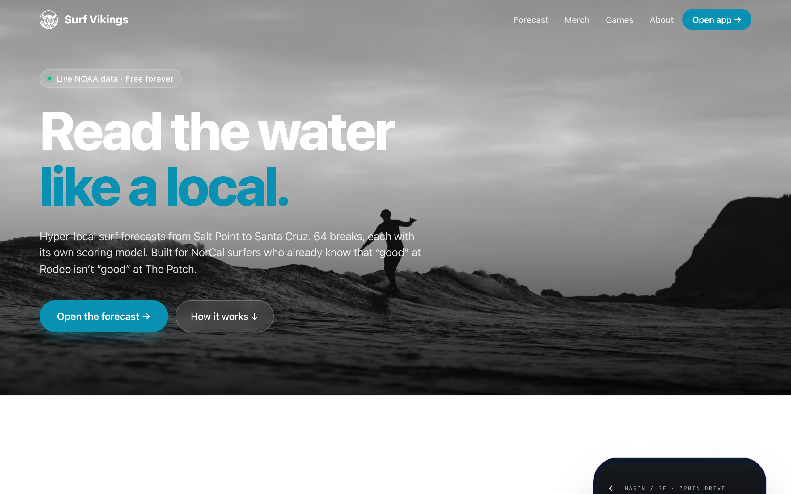

# Surf Vikings — Résumé Version

**Hyper-local NorCal surf forecasting PWA · [surfvikings.com](https://surfvikings.com)**

*Sole designer, engineer, and product lead · 2026*

---

### What it is

A progressive web app that scores **64 Northern California surf breaks** hour-by-hour across a 7-day horizon using free public NOAA, Open-Meteo, NWS, and county-environmental-health data. Every spot has its own bathymetry profile, swell shadow factor, tide dependency, and wind exposure baked in — so "good at Rodeo" and "good at The Patch" aren't the same score. **Live water quality from 5 county health departments** is wired into per-spot detail pages — a layer no other surf app surfaces. The thesis: a NorCal surfer's real decision isn't "what are the conditions?" — it's "which break, at what hour, is worth the drive, and is the water clean enough to paddle out?"

### What I shipped

- **64 NorCal spots** modeled with per-spot scoring coefficients (swell direction window, size range, period, offshore wind, shadow factor, sand mobility, tide dependency, special rules, ground-truth notes)
- **8 live public data sources** — NDBC standard met buoys + NDBC spectral buoys (47 frequency bins, multi-train decomposition) + NOAA CO-OPS tides + Open-Meteo Marine + Open-Meteo Forecast + NOAA NWS Coastal Waters Forecast text + 5 county water-quality endpoints
- **Water quality aggregator** — Sonoma (HTML scrape) + SFPUC (undocumented JSON API) + San Mateo (Google MyMaps KML) + Santa Cruz (ArcGIS Feature Service, 4-tier status model) + Marin (ArcGIS Feature Service, unlocked via direct outreach to Marin County IT). Unified `open / caution / closed` status model across heterogeneous sources.
- **Forecast calendar feed** at `/api/calendar.ics` — pure RFC 5545 generator emits one VEVENT per forecasted best window per favorite spot, with `VALARM` triggers for OS-native pre-event notifications and deep-link URLs back to spot detail pages. Closes the "push notifications" requirement with zero new infrastructure (no DB, no auth, no Vercel Cron).
- **Custom scoring engine** with multi-swell decomposition — pure deterministic 0–100 score per spot per hour. 96 Vitest tests. Multi-train spectral peak-finding over NDBC 47-bin data. Per-spot `shadowFactor` calibration calibrated against coastal geometry (Cowells 0.30 deep shadow, Steamer Lane outside 0.90 fully exposed).
- **Live spectral peak override for hour-0 scoring** — Open-Meteo's `swell_wave_period` field collapses multi-modal seas into a single mean that can land closer to the windswell than the groundswell. The current-hour score now reads off the dominant H²·T peak from the mapped buoy's live `.data_spec` decomposition instead. Closed a real accuracy gap (Bolinas Patch score moved from 32/100 to 49/100 on a 14.7s NW groundswell day where the model was reporting a 7s windswell as primary).
- **Master-scrub interaction pattern on Forecast** — Surfline-style synchronized cursor across one 7-day quality heatmap and four dense metric strip charts. One finger drag drives all five surfaces; the bar charts are intentionally compressed to ~1.3px per bar because they read as cursor targets, not as standalone visualizations. Built on a custom `useGridScrub` hook (2D pointer-events scrub with `setPointerCapture`, 4px deadzone, and lastCellRef gating) and an `externalActiveHour` prop on the existing `ForecastChart` so child charts opt into being externally driven.
- **Expand-in-place score breakdown** — each of the five score rows on Spot Detail (Direction, Period, Size, Wind, Tide) expands to reveal plain-English math: "10s = short-period groundswell, carries 69% the energy of a 12s wave; 4s short of the 14-18s window, penalty is 3 pts per second under." Cosine² falloff explained, shadowFactor math made visible, next-tide-pivot computed from the 24h timeline. No new viz, prose only — the compass and tide chart already on screen do the visual half.
- **Ground-truth feedback loop** — `Spot.localNote` field captures per-spot caveats from real surfers on the water (e.g., Muir Beach: "NW wind wraps around the headland and arrives in the cove as offshore"). Architectural seed for a typed `LocalRule` framework that converts accumulated observations into structured scoring deltas.
- **PWA with in-app update toast** — `useRegisterSW` + 10-minute polling so a "New version available · Refresh" banner appears whenever a deploy lands. Replaces the universal "hard refresh to bypass the service worker" friction.
- **Marketing site** — Landing, Merch storefront (23 Printful products + Cloudflare-bypass scraper using `page.goto()` through authenticated Chromium), Games, About — same domain, same design language, route-separated from the PWA
- **Zero-downtime domain migration** — legacy DreamHost → Vercel while preserving email at the same domain; decoupled web hosting from email hosting via DNS surgery
- **Living dashboard header** — minute-aligned ticking clock, time-aware greeting, localStorage-backed name + home base, real buoy air temp + top-spot wind, inline editing that works identically in browser, standalone PWA, and in-app WebView (iOS `window.prompt()` doesn't fire in standalone mode — refactored to inline `<input>`)

### Engineering & product principles worth quoting

1. **Model the domain before writing the UI** — 14-field `Spot` type and pure `computeScore()` existed before any component rendered them
2. **Graceful degradation by default** — three-state rendering never leaves the user staring at a spinner
3. **Color conveys quality, not state** — 7-tier phosphor → amber palette instead of red/green stoplight
4. **When the platform fights you, route through what the platform trusts** — Cloudflare bypass via real Chromium `page.goto()`, not challenge-solving
5. **Decouple orthogonal concerns** — web hosting and email hosting are different services that happen to share a domain; DNS is the seam
6. **Platform affordances over platform APIs** — inline `<input>` swap instead of `window.prompt()`, which iOS standalone PWAs silently suppress
7. **Editorial systems, not editorial content** — product copy lives in a mapping table, inherits defaults, survives scraper re-runs
8. **Fidelity beats coverage when the numbers are wrong** — adding more spots wouldn't have fixed Bolinas reading 5.1ft @ 7s when reality was 1.7ft @ 17s. Spectral decomposition + `shadowFactor` + multi-swell separation closed the gap.
9. **The polite email path works** — two real county data sources from two different teams within 24 hours. Email cost 15 minutes; engineering cost of a headless-browser bypass would have been days.
10. **Reframe the requirement before building the infrastructure** — "push notifications" became "subscribe to a calendar feed." Same user benefit, zero new infrastructure, works on every device including iOS without PWA install.
11. **Build the loop, not the answer** — a model that improves from ground-truth feedback beats a model that's perfect at v1. `Spot.localNote` is one line of TS; the framework it seeds is the actual feature.
12. **When an affordance lies, fix the affordance, not the lie** — killed Imperial/Metric (US-focused app), removed Mavericks watch toggle (no delivery path), replaced Epic alerts with the calendar feed. Honest disclosure beats over-claim.
13. **Iterate in commits, not in branches** — 220 commits, mostly linear, with preview branches only for features needing external review
14. **Trust observation over model when both are in hand** — buoy spectral data is real, Open-Meteo's collapsed period is a derived summary. When they disagree on the current hour, prefer the observation; the model only earns the future
15. **The cursor is the chart** — dense time-series on a small screen doesn't need to be navigable in every panel, only readable once a point is picked. Linked/synchronized scrubbing turns four "unreadable" sparkline charts into four readouts driven by one obvious interactive surface
16. **WebKit on iOS is its own platform** — `touch-action: none` doesn't suppress text selection; that takes `-webkit-touch-callout: none` + `-webkit-user-select: none`. The browser-on-Mac demo will look fine and the iPhone build will pop the Copy/Look-Up menu the first time a real user long-presses. Ship to the device early

### Stack & scope

`Vite 5 · React 18 · TypeScript 5 · vite-plugin-pwa · react-router-dom v7 · Vercel Edge Functions · Vitest · Playwright · Sharp · SunCalc · Let's Encrypt`

**~8,630 lines of TypeScript across 52 source files · 220 commits · 64 surf spots modeled · 7-day hourly forecast horizon · 96 Vitest tests across 10 files · 8 live public data sources · 5 county water-quality endpoints · 4 third-party JS dependencies · $0 hosting · $0 data**

### Measurable outcomes

- Custom domain live on Vercel with auto-provisioned TLS, edge-cached from SFO
- Installable PWA with iOS safe-area + Home Screen standalone support + in-app update toast
- 23-product merch storefront with automated image pipeline, ~20KB WebP per product
- Forecast calendar feed delivering OS-native pre-event notifications across Apple Calendar, Google Calendar, Outlook, and any RFC 5545 client
- Civic-data integration: 5 county environmental-health departments wired live, including a direct ArcGIS endpoint provided by Marin County IT after a polite email exchange
- Zero-downtime migration from legacy shared hosting, email continuity preserved
- Closed-loop ground-truth feedback: real surfers report ratings, model captures the systematic miss as a typed per-spot field

---

*[Full case study](./case-study.md) · [Repo](https://github.com/elieljohnson/surfvikings) · [Live](https://surfvikings.com)*
