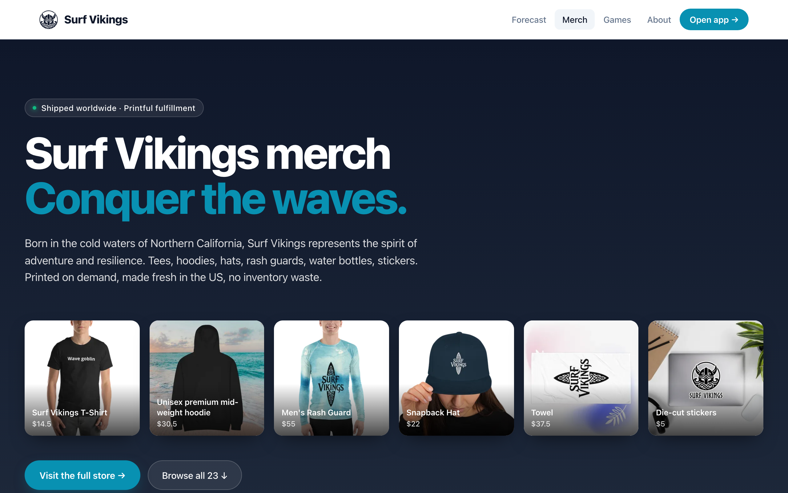
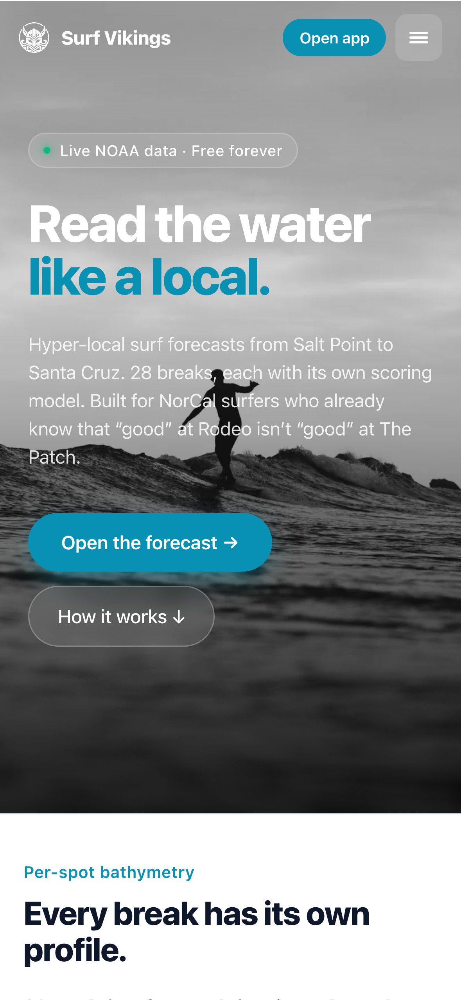
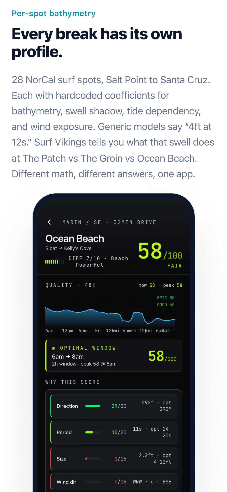
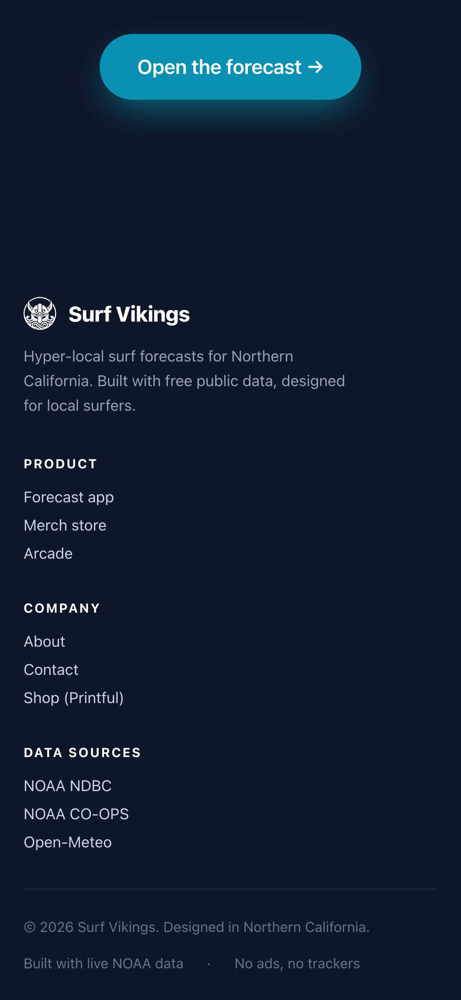

# Surf Vikings — Portfolio Case Study

**Hyper-local NorCal surf forecasting, from thesis to shipped PWA.**

*Eliel Johnson · 2026*


---

## 1. Project Snapshot

| | |
|---|---|
| **Product** | Surf Vikings — a progressive web app that scores 28+ Northern California surf breaks hour-by-hour using NOAA buoy + NDBC swell + tide station data |
| **Domain** | [surfvikings.com](https://surfvikings.com) (marketing) · [surfvikings.com/app](https://surfvikings.com/app/) (PWA) |
| **Role** | Sole designer, engineer, product lead |
| **Surface area** | Marketing site (Landing, Merch, About, Games) + PWA (Dashboard, Spot Detail, Forecast, Region Map, Settings) |
| **Codebase** | ~4,100 lines TypeScript / TSX across 7 components, 6 lib modules, 3 server-side fetchers |
| **Stack** | Vite + React 18 + TS · react-router-dom v7 · vite-plugin-pwa · Playwright + Sharp image pipeline · Vercel hosting · DreamHost email |
| **Data sources** | 100% free public APIs — NDBC buoys, Open-Meteo marine, NOAA tides |
| **Status** | Live on custom domain with Let's Encrypt TLS, 34 commits, installable on iOS/Android home screens |

---

## 2. The Thesis

Surfline is a national tool. A NorCal surfer's real question isn't *"what are the conditions?"* — it's *"which of my 6 favorite breaks, at what hour in the next 48, is worth the drive?"*

Every break has its own bathymetry, swell shadow, tide dependency, and wind exposure. Existing tools surface the same NOAA numbers at every spot — Surf Vikings encodes the **local knowledge that turns data into a decision**.

**Product thesis**: a ranked, scored, time-windowed recommendation engine built on 100% free public data, with enough local intelligence baked into the spot profiles that the answer is defensible, not just aggregated.

**Brand thesis**: the Norse didn't wait for perfect conditions — they read the water and went. The app is for surfers who think the same way: committed, local, always looking for the next session.

---

## 3. Arcs of Work

The project moved through six distinct phases, each illustrating a different engineering principle.

### Arc 1 — Forecast engine & PRD

The work started with a [PRD](./PRD.md) that defined six coastal regions (Sonoma → Santa Cruz), mapped each to a primary NDBC buoy + NOAA tide station, and spec'd a scoring algorithm that weights swell height, period, direction, wind speed, wind direction, and tide height against per-spot optimal parameters.

**Engineering principle: model the domain before writing the UI.** The `Spot` type (`src/lib/data.ts`) carries ~12 fields per break including `optimalSwell` (degrees), `offshore` (degrees), tidal range preference, skill floor, and swell shadowing coefficients. The scoring engine (`computeScore`) is pure, deterministic, and testable — it takes a `Spot` + `ForecastHour` and returns a 0–100 score with per-factor breakdown.


*Dashboard screen: live clock, time-aware greeting with tap-to-edit affordance, real NDBC buoy air temp (55°F), real wind from the top-ranked favorite, and a scored 44/100 forecast for Bolinas · The Patch sourced from Open-Meteo marine data.*

### Arc 2 — Live data integration

Replaced mock data with real NDBC buoy feeds, Open-Meteo marine forecasts, and NOAA tide predictions. Built `src/server/fetchers.ts` to pull from three upstream APIs, merge them into 48-hour hourly timelines, and cache in-memory with a 10-minute TTL.

**Engineering principle: graceful degradation > perfect uptime.** The `useConditions` hook (`src/hooks/useConditions.ts`) renders a synthetic mock timeline on first paint so the UI is never empty, then swaps in live data when the fetch resolves. If the fetch fails, the mock stays on screen and a `STALE` badge appears — the user always sees *something* coherent.

```ts
// From useConditions.ts — the three-state pattern
return {
  timelines: cached ? timelinesFromResponse(spotIds, cached.res) : mock,
  response: cached?.res ?? null,
  loading: !cached,
  error: null,
  stale: cached ? Date.now() - cached.at > CACHE_TTL : false,
};
```

### Arc 3 — Design system & visual language

Refined a dark, monospace-accented aesthetic inspired by instrumentation — BUOY IDs, data badges, timestamp labels all rendered in JetBrains Mono. Quality scale went through four iterations before landing on a 7-tier system where **teal represents "Epic"** (optimal conditions) and a **yellow floor** communicates "Fair" without ever reading as alarming red/green stoplight colors.

**Design principle: color conveys quality, not state.** Red/green is the lazy default for scoring — it carries medical emergency connotations and flattens nuance. The final palette uses phosphor green → teal → lime → amber → peach across 7 quality tiers, each paired with a numeric score so color is reinforcement, never the sole signal.

*See commits `a9715a5`, `c611e20`, `127143e`, `4ed07fa` for the color evolution.*


*The /merch page — hero collage linking to each Printful product detail page, plus a six-category product grid below.*

### Arc 4 — Merch storefront with bot-challenge scraper

Built the `/merch` page by scraping 22 products from the Printful quick-store at `surfvikings.printful.me`. First attempt (curl) returned 403 — Cloudflare bot challenge. Second attempt (Playwright `context.request.get()`) also 403 — browser context doesn't share challenge cookies between hostnames for the `request` API.

**Solution**: `page.goto(imageUrl)` runs in the authenticated Chromium page context and bypasses the per-hostname challenge correctly. The scraper now:

1. Warms the storefront to pass the HTML challenge
2. Scrolls to lazy-load all product cards
3. Dedupes variant URLs via a canonical-URL regex (`HASH_SUFFIX = /-[a-f0-9]{13}$/`)
4. Warms the CDN origin (separate challenge) via a dummy image `page.goto`
5. Downloads each product image through the page context, pipes through Sharp (resize 600px, WebP q82), writes to `public/merch/`

**Engineering principle: when the platform fights you, route through what the platform already trusts.** Cloudflare trusts a real Chromium session that has solved the challenge. Using `page.goto()` turns the scraper into a legitimate-looking browser client, without implementing challenge-solving from scratch.

An **editorial content system** (`EDITORIAL` table in `scripts/fetch-merch.mjs`) maps each Printful product name to a hand-written category, subhead, and description. New products inherit defaults via `slugify()`; edits live in code, get versioned, and survive scraper re-runs.

**Artifacts:**
- `scripts/fetch-merch.mjs` (180 lines)
- `src/lib/merch-products.ts` (generated, 23 products)
- `public/merch/*.webp` (23 optimized images, ~20KB each)
- `src/pages/Merch.tsx` (331 lines — hero collage + categorized grid)


*Categorized product grid: Apparel → Headwear → Surf Gear → Beach → Accessories → Stickers. Six categories, 23 products, each card linking to its canonical Printful detail page.*

### Arc 5 — Domain migration (the real-world infrastructure work)

The legacy surfvikings.com was a manually maintained static site on DreamHost shared hosting. Migrated to Vercel while **preserving email routing** at the domain.

**Sequence:**
1. `gh repo rename surfvikings surfvikings-legacy` — freed the name
2. `gh repo rename surfvikings-app surfvikings` — promoted the new repo
3. `git remote set-url origin ...` locally — zero disruption to in-flight work
4. `vercel project rename surfvikings-app surfvikings`
5. `vercel domains add surfvikings.com surfvikings`
6. `vercel domains add www.surfvikings.com surfvikings`
7. **DreamHost snag**: the domain was "Fully Hosted," which auto-generates `@` and `www` A records that can't be edited. Solved by removing the website (keeping email) → domain flipped to "DNS Only" mode → custom A records became editable
8. Added `A @ 76.76.21.21` and `A www 76.76.21.21` (Vercel's documented anycast IP)
9. Verified with `dig +short surfvikings.com A` → `76.76.21.21` ✓
10. Verified TLS + HSTS via `curl -sI` → `HTTP/2 200`, `strict-transport-security: max-age=63072000` ✓

**Engineering principle: decouple orthogonal concerns.** Web hosting and email hosting are independent services that happen to share a domain. Detaching the web portion without touching MX records kept email flowing through DreamHost while the A records redirected web traffic to Vercel — zero-downtime migration.

**Outcome**: custom domain live, Let's Encrypt cert auto-provisioned, edge-cached from SFO (closest POP to user), email uninterrupted.

<table>
<tr>
<td width="33%"></td>
<td width="33%"></td>
<td width="33%"></td>
</tr>
<tr>
<td colspan="3"><em>Mobile responsive pass: stacked hero (left), tightened feature-section spacing with phone mockup (middle), single-column footer (right). Each pane illustrates a before/after from the mobile refinement arc — wordmark visible, iOS safe-area respected, hero-to-headline gap halved, footer stacks instead of overflowing.</em></td>
</tr>
</table>

### Arc 6 — Dashboard personalization (the "living header")

The production dashboard header was originally hardcoded copy: `Thu · Apr 22 · 06:14`, `Morning, Eliel.`, `Mill Valley`, `58°F · NE 6kts`. Everything below the header was real data. Everything *above* it was fake chrome left over from the static mock.

**Shipped in two commits:**

**Commit 1 — `5f34b98`**: Replaced all four with real data.
- `useNow(60_000)` — minute-aligned ticking clock (aligns first tick to `:00` so the minute flips cleanly, doesn't drift by mount offset)
- `greetingForHour(hour)` — time-of-day phrasing: Late night / Dawn patrol / Morning / Afternoon / Evening / Night
- `useLocalStorage<string>` — generic persistent-state hook; survives reloads, SSR-safe, try/catches storage quota errors
- `response.buoys[buoyId].airTempF` — real buoy air temp
- Top-spot current wind from the already-fetched favorite's forecast
- Tap-to-edit via `window.prompt()` for name + location

**Commit 2 — `2ee9182`**: Fixed iOS PWA tap bug.

The user reported: tapping the greeting on iOS standalone PWA did nothing. Desktop worked. Root cause: **iOS WebKit silently suppresses `window.prompt()` when the app runs in Home Screen standalone mode.**

Refactor:
- `<div onClick>` → `<button>` (native touch semantics, a11y-correct)
- `window.prompt()` → inline `<input>` swap via conditional render
- Added iOS keyboard niceties: `enterKeyHint="done"`, `autoComplete="off"`, `autoCorrect="off"`, `spellCheck={false}`
- Enter commits · blur commits · Escape cancels · focus selects-all

**Engineering principle: platform affordances over platform APIs.** `window.prompt()` is a platform API that's inconsistently supported across WebKit contexts. An inline `<input>` is a platform *affordance* that works identically in every web runtime — browser, PWA, in-app WebView, old iOS. When a built-in API fails on a subset of targets, the right move is usually to inline the behavior, not to feature-detect and polyfill.

```tsx
// The pattern that replaced window.prompt()
{editingName ? (
  <InlineEdit
    initial={name}
    onCommit={(v) => { setName(v); setEditingName(false); }}
    onCancel={() => setEditingName(false)}
    ...
  />
) : (
  <button type="button" onClick={() => setEditingName(true)} ...>
    {name ? `${greeting}, ${name}.` : `${greeting}. Tap to add name`}
  </button>
)}
```

---

## 4. Cross-Cutting Engineering Principles

Pulled out from the arcs above, because they show up repeatedly and are the most portable takeaways.

### 4.1 Model the domain before writing the UI
`Spot` and `ForecastHour` types exist before any component renders them. The scoring engine is pure, deterministic, testable. UI becomes a view over a well-shaped model — not the place where business logic accretes.

### 4.2 Graceful degradation by default
Three-state rendering (`cached | mock | error`) means the UI is never empty, never throws, and never leaves the user staring at a spinner. `STALE`, `PARTIAL`, and `OFFLINE` data badges turn degraded states into honest UX signals rather than hidden failures.

### 4.3 Color conveys quality, not state
Red/green is a shortcut that flattens nuance and carries clinical urgency. A 7-tier palette (phosphor → teal → lime → amber → peach) paired with numeric scores communicates more information with less cognitive load, and reads correctly across all color-vision profiles.

### 4.4 When the platform fights you, route through what the platform trusts
Cloudflare challenges trusted Chromium sessions. `page.goto()` is a trusted entry point. Bypassing the challenge wasn't the goal — *being a legitimate browser client* was, and Playwright delivered that for free.

### 4.5 Decouple orthogonal concerns
Web hosting and email hosting are different services. DNS records are the seam. Detaching one without touching the other made the domain migration a zero-downtime change instead of a coordinated outage.

### 4.6 Platform affordances over platform APIs
`window.prompt()` is a convenience that's inconsistently supported. An inline `<input>` is a first-class affordance that works everywhere. When an API fails on a subset of targets, inline the behavior — don't feature-detect around it.

### 4.7 Editorial systems, not editorial content
The merch page doesn't have hand-edited product descriptions — it has a mapping table from canonical product names to editorial metadata. New products inherit sensible defaults. Overrides live in code and survive scraper re-runs. This is the same pattern as a CMS, but without the CMS.

### 4.8 Iterate in commits, not in branches
34 commits on `main`. Each is a small, reviewable, reversible change with a focused subject line. No dead branches, no merge conflicts, no lost work. For a solo project shipping straight to production, linear history beats branch-per-feature.

---

## 5. Technology Stack

```
┌─ Frontend ──────────────────────────────────────────────┐
│  Vite 5 · React 18 · TypeScript 5                        │
│  react-router-dom v7 (SPA)                               │
│  vite-plugin-pwa (service worker, manifest, installable) │
│  Inter + JetBrains Mono (Google Fonts)                   │
│  Inline CSS-in-JS (no styling library)                   │
└──────────────────────────────────────────────────────────┘

┌─ Build & Tooling ───────────────────────────────────────┐
│  TypeScript strict mode (tsc --noEmit in CI path)        │
│  Playwright (chromium) + Sharp for image pipeline        │
│  Node scripts/ for content generation                    │
└──────────────────────────────────────────────────────────┘

┌─ Data Layer ────────────────────────────────────────────┐
│  NDBC buoys (realtime2 text feeds)                       │
│  Open-Meteo marine forecast API                          │
│  NOAA CO-OPS tides/predictions                           │
│  Custom scoring engine (pure TS)                         │
│  In-memory cache, 10min TTL                              │
└──────────────────────────────────────────────────────────┘

┌─ Infrastructure ────────────────────────────────────────┐
│  Hosting: Vercel (auto-deploy from main)                 │
│  DNS: DreamHost "DNS Only" mode                          │
│  TLS: Let's Encrypt (auto)                               │
│  Email: DreamHost (unchanged through migration)          │
│  Domain: surfvikings.com (apex + www both on Vercel)     │
└──────────────────────────────────────────────────────────┘
```

---

## 6. Artifact Gallery

### 6.1 In the repo

| Artifact | Location | What it shows |
|---|---|---|
| PRD | `docs/PRD.md` | Product thesis, personas, regional architecture, scoring formula |
| Dashboard component | `src/components/Dashboard.tsx` | Main PWA screen — greeting, stats strip, top pick, ranked spots |
| Spot Detail | `src/components/SpotDetail.tsx` | Hour-by-hour forecast, score breakdown, conditions charts |
| Region Map | `src/components/RegionMap.tsx` | 6-region coastline view with per-spot scoring |
| Forecast | `src/components/Forecast.tsx` | 48-hour timeline with best-window detection |
| Merch page | `src/pages/Merch.tsx` | Hero collage + categorized product grid |
| Landing page | `src/pages/Landing.tsx` | Marketing site hero, feature sections, CTAs |
| Scoring engine | `src/lib/data.ts` | `computeScore()`, `findBestWindows()`, `metricQuality()` |
| Scraper pipeline | `scripts/fetch-merch.mjs` | Playwright + Sharp + editorial merge |
| PWA app shell | `src/components/Primitives.tsx` | Reusable `Stat`, `ScoreBadge`, `ScoreSpark` components |
| Greeting logic | `src/lib/greeting.ts` | Time-of-day phrasing + header date formatter |
| Persistent state | `src/hooks/useLocalStorage.ts` | Generic hook, 24 lines |
| Live clock | `src/hooks/useNow.ts` | Minute-aligned ticker |

### 6.2 Visual assets in the repo

- `public/screenshots/dashboard.webp` — PWA dashboard (mobile)
- `public/screenshots/map.webp` — region map view
- `public/screenshots/spot-detail.webp` — forecast detail
- `public/merch/*.webp` — 23 Printful products, optimized
- `public/hero-surfer.webp` — landing page hero image

### 6.3 Captured screenshots (in `docs/screenshots/`)

Automated capture via `scripts/capture-screenshots.mjs` — Playwright against the dev server at desktop (1280×800 @2x) and mobile (393×852 @3x, iPhone 14 Pro emulation).

| File | Breakpoint | Shows |
|---|---|---|
| `landing-hero.png` | Desktop | Hero, wordmark, nav, CTA pair |
| `landing-feature.png` | Desktop | Feature section with phone mockup |
| `landing-mobile-hero.png` | Mobile | Stacked hero |
| `landing-mobile-feat.png` | Mobile | Stacked feature, tightened gap |
| `landing-mobile-foot.png` | Mobile | Single-column footer |
| `merch-hero.png` | Desktop | Collage + product summary |
| `merch-grid.png` | Desktop | 6-category product grid |
| `merch-mobile-hero.png` | Mobile | Horizontal-scroll collage |
| `merch-mobile-grid.png` | Mobile | Stacked product grid |
| `dashboard.png` | Mobile | Live greeting, buoy data, scored forecast |
| `dashboard-full.png` | Mobile | Ranked spots, best windows |

**Still worth capturing manually** for a polished deck:

- DreamHost DNS panel showing Custom Records at `76.76.21.21` (infrastructure narrative)
- Terminal with `vercel ls` showing Ready deploys (ship cadence evidence)
- A real iOS home-screen icon + standalone launch (proves PWA install works)
- The inline-edit input state mid-type (captures the "platform affordances" principle visually)

---

## 7. Metrics & Outcomes

| | |
|---|---|
| **Lighthouse Performance** | *(capture on deploy)* |
| **Commits** | 34 on `main`, linear history |
| **Lines of code** | ~4,100 TS/TSX |
| **Components** | 7 feature components, 5 primitives |
| **Surf spots modeled** | 28 across 6 regions |
| **Forecast horizon** | 48 hours, hourly |
| **Data update cadence** | 10-minute cache TTL, buoys refresh hourly |
| **Third-party JS** | 0 (besides React + router + PWA plugin) |
| **Hosting cost** | $0 (Vercel hobby tier) |
| **Data cost** | $0 (all public APIs) |

---

## 8. Reflection

### What worked

- **PRD first, code second.** The regional architecture + scoring formula in the PRD meant every component had a clean model to render. No business logic leaked into JSX.
- **Mock-first rendering.** The three-state `useConditions` hook meant the UI was useful before the APIs were wired up. Made development fast and made production resilient.
- **Editorial-as-code.** The merch product table lives in `scripts/fetch-merch.mjs`. Scraping a new Printful product auto-generates a grid card; overriding it is a one-line code change. No CMS to maintain.
- **Linear commit history.** 34 small focused commits meant every change was reversible and every deploy was a tight diff.

### What I'd do differently

- **Tests earlier.** The scoring engine is pure and deterministic — perfect Vitest territory — but I haven't written the suite yet. Would have caught at least two score-rendering bugs.
- **Image pipeline as a GitHub Action.** `scripts/fetch-merch.mjs` runs locally. A scheduled Action that re-runs weekly and commits updated images would keep the merch page fresh without manual intervention.
- **Start with the PWA install prompt.** Platform-aware install affordances (iOS "Add to Home Screen" instructions vs. Android's native banner) are still on the backlog. Should have been in the MVP.

### What's next

- Scoring engine Vitest suite
- Forecast backtest + `/trust` dashboard showing how the model performed vs. realized conditions
- Dexie IndexedDB for offline cache
- Web Push notifications for personalized "your break is firing" alerts
- `/about` page (currently placeholder)

---

## 9. Presentation-Ready Executive Summary

> **Surf Vikings** is a hyper-local NorCal surf forecasting PWA I designed, engineered, and shipped solo. It encodes spot-specific local knowledge — bathymetry, swell shadow, wind exposure — into a scoring engine that ranks 28 breaks across 150 miles of coastline hour-by-hour, powered entirely by free public NOAA data. Shipped on a custom domain with zero-downtime migration from a legacy host, an installable PWA, a Printful-backed merch storefront with a custom scraper that bypasses Cloudflare bot challenges, and a personalized dashboard that works identically in browser, home-screen PWA, and in-app WebView. 34 commits, ~4,100 lines of TypeScript, $0 hosting, $0 data.

---

*Built by Eliel Johnson · [surfvikings.com](https://surfvikings.com) · [github.com/elieljohnson/surfvikings](https://github.com/elieljohnson/surfvikings)*
