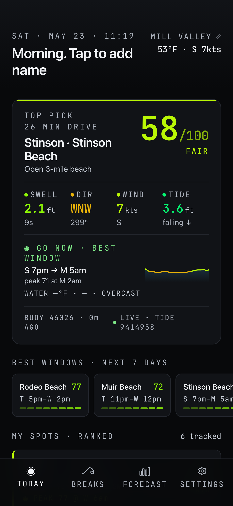
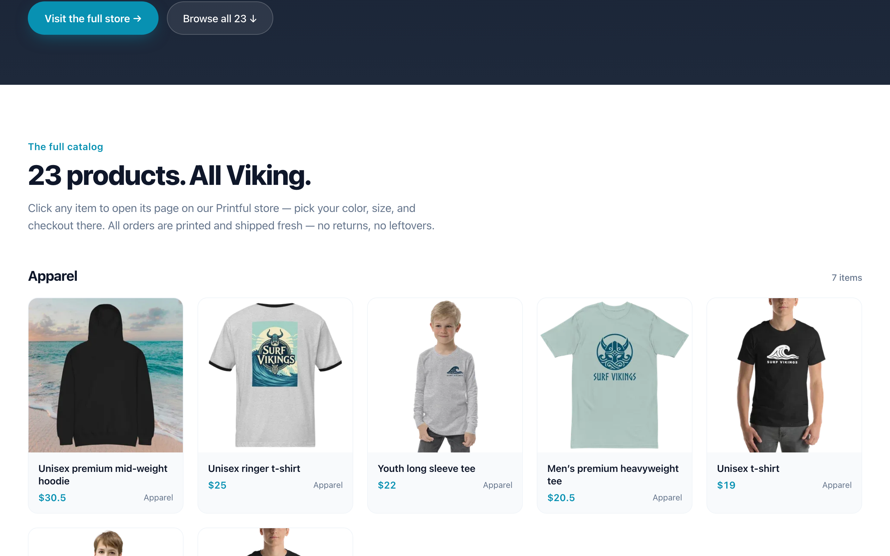

# Surf Vikings — Portfolio Case Study

**Hyper-local NorCal surf forecasting, from thesis to shipped product.**

*Eliel Johnson · 2026*


---

## 1. Project Snapshot

| | |
|---|---|
| **Product** | Surf Vikings — a progressive web app that scores **64 Northern California surf breaks** hour-by-hour using free public NOAA, Open-Meteo, NWS, and county-environmental-health data |
| **Domain** | [surfvikings.com](https://surfvikings.com) (marketing) · [surfvikings.com/app](https://surfvikings.com/app/) (PWA) |
| **Role** | Sole designer, engineer, product lead |
| **Surface area** | Marketing site (Landing, Merch, About, Games) + PWA (Dashboard, Spot Detail, Forecast, Region Map, Settings) + public API (`/api/conditions`, `/api/calendar.ics`) |
| **Codebase** | ~8,630 lines TypeScript/TSX across 52 source files |
| **Stack** | Vite + React 18 + TS · react-router-dom v7 · vite-plugin-pwa · Vercel Edge Functions · Vitest · Playwright + Sharp · DreamHost email |
| **Data sources** | 100% free public data — NDBC spectral + standard met buoys, Open-Meteo marine, NOAA CO-OPS tides, NOAA NWS coastal-waters forecast text, plus **5 live county water-quality feeds** (Sonoma, SFPUC, San Mateo, Santa Cruz, Marin) |
| **Tests** | 96 Vitest tests across 10 files covering scoring, parsers, buoy spectral peak selection, time math, calendar generation |
| **Status** | Live on custom domain with Let's Encrypt TLS, **220 commits**, installable PWA, weekly-refreshing water-quality + 7-day forecast |

---

## 2. The Thesis

Surfline is a national tool. A NorCal surfer's real question isn't *"what are the conditions?"* — it's *"which of my 6 favorite breaks, at what hour in the next 7 days, is worth the drive, and is the water clean enough to paddle out?"*

Every break has its own bathymetry, swell shadow, tide dependency, and wind exposure. Existing tools surface the same NOAA numbers at every spot. Surf Vikings encodes the **local knowledge that turns data into a decision** — and it pulls that local knowledge from real surfers on the water, not just NOAA buoys.

**Product thesis:** a ranked, scored, time-windowed recommendation engine with three things no other surf app has put together: (1) per-spot scoring built on encoded local geometry, (2) live county-level water quality merged into per-spot detail pages, and (3) a structured way to capture and iterate against ground-truth surfer feedback.

**Brand thesis:** the Norse didn't wait for perfect conditions — they read the water and went. The app is for surfers who think the same way: committed, local, always looking for the next session.

---

## 3. Arcs of Work

The project moved through fifteen arcs across six sessions, each illustrating a different engineering, design, or product principle.

### Arc 1 — Forecast engine & PRD

Started with a [PRD](./PRD.md) defining six coastal regions (Sonoma → Santa Cruz), mapping each to a primary NDBC buoy + NOAA tide station, and spec'ing a scoring algorithm that weights swell height, period, direction, wind speed, wind direction, and tide height against per-spot optimal parameters.

**Engineering principle: model the domain before writing the UI.** The `Spot` type (`src/lib/data.ts`) carries ~14 fields per break including `optimalSwell` (degrees), `offshore` (degrees), tidal range preference, skill floor, `shadowFactor` (fraction of open-ocean energy that reaches the break), `sandMobility` (rate of bottom-contour change), `specialRules` (per-spot scoring exceptions), and `localNote` (ground-truth caveat). The scoring engine (`computeScore`) is pure, deterministic, testable — takes a `Spot` + `ForecastHour` and returns a 0–100 score.


*Dashboard: live clock, time-aware greeting with tap-to-edit affordance, real NDBC buoy air temp, real wind from the top-ranked favorite, scored 7-day forecast for Bolinas · The Patch from Open-Meteo marine data + the local scoring engine.*

### Arc 2 — Live data integration

Replaced mock data with real NDBC buoy feeds, Open-Meteo marine forecasts, and NOAA tide predictions. Built `src/server/fetchers.ts` to pull from upstream APIs in parallel via `Promise.all`, merge into 7-day hourly timelines, and cache server-side.

**Engineering principle: graceful degradation > perfect uptime.** The `useConditions` hook renders a synthetic mock timeline on first paint so the UI is never empty, then swaps in live data when the fetch resolves. If the fetch fails, the mock stays on screen and a `STALE` badge appears — the user always sees *something* coherent.

### Arc 3 — Design system & visual language

A dark, monospace-accented aesthetic inspired by instrumentation — BUOY IDs, data badges, timestamp labels all in JetBrains Mono. Quality scale went through four iterations before landing on a 7-tier system where **teal represents "Epic"** and a **yellow floor** communicates "Fair" without ever reading as red/green stoplight.

**Design principle: color conveys quality, not state.** Red/green is the lazy default — it carries medical-emergency connotations and flattens nuance. The palette uses phosphor → teal → lime → amber → peach across 7 quality tiers, each paired with a numeric score so color is reinforcement, never the sole signal.

### Arc 4 — Merch storefront with bot-challenge scraper

Built the `/merch` page by scraping 22 products from `surfvikings.printful.me`. First attempt (curl) returned 403 — Cloudflare bot challenge. Second attempt (Playwright `context.request.get()`) also 403 — browser context doesn't share challenge cookies between hostnames for the `request` API.

**Solution:** `page.goto(imageUrl)` runs in the authenticated Chromium page context and bypasses the per-hostname challenge correctly. Each product image is downloaded through the page context, piped through Sharp (resize 600px, WebP q82), written to `public/merch/`.

**Engineering principle: when the platform fights you, route through what the platform already trusts.** Cloudflare trusts a real Chromium session that has solved the challenge. Using `page.goto()` turns the scraper into a legitimate-looking browser client without implementing challenge-solving from scratch.


*Categorized product grid: Apparel → Headwear → Surf Gear → Beach → Accessories → Stickers. Six categories, 23 products, each card linking to its canonical Printful detail page.*

### Arc 5 — Domain migration

Migrated the legacy surfvikings.com from DreamHost shared hosting to Vercel while **preserving email routing** at the domain. The snag: DreamHost's "Fully Hosted" mode auto-generates `@` and `www` A records that can't be edited. Solved by removing the website (keeping email) → domain flipped to "DNS Only" → custom A records became editable. Added `A @ 76.76.21.21` and `A www 76.76.21.21` (Vercel's anycast IP). Verified via `dig` + `curl -sI`.

**Engineering principle: decouple orthogonal concerns.** Web hosting and email hosting are independent services that happen to share a domain. Detaching one without touching MX records kept email flowing through DreamHost while web traffic redirected to Vercel — zero-downtime migration.

### Arc 6 — Dashboard personalization (the "living header")

Replaced hardcoded header copy with real data: minute-aligned ticking clock, time-aware greeting (Dawn patrol / Morning / Afternoon / Evening / Night), localStorage-backed name + home base, real buoy air temp, top-spot wind, inline editing.

**Critical iOS PWA fix:** `window.prompt()` is silently suppressed when the app runs in Home Screen standalone mode. Refactored to inline `<input>` swap via conditional render. Added `enterKeyHint="done"`, `autoComplete="off"`, `autoCorrect="off"`, `spellCheck={false}`. Works identically in browser, PWA, in-app WebView.

**Engineering principle: platform affordances over platform APIs.** `window.prompt()` is a platform API that's inconsistently supported across WebKit contexts. An inline `<input>` is a platform *affordance* that works identically everywhere. When a built-in API fails on a subset of targets, inline the behavior — don't feature-detect and polyfill.

### Arc 7 — Forecast fidelity push (the Bolinas reckoning)

Eliel screenshotted Surfline showing **1.7ft @ 17s SW** at Bolinas while our app showed **5.1ft @ 7s WNW** for the same break, same hour. Same Pacific, completely different headline. Multi-commit arc to close the gap:

- **Multi-swell decomposition** — Open-Meteo returns three separate datasets per hour: `swell_wave_*` (primary groundswell), `wind_wave_*` (local chop), combined `wave_*`. We were averaging them and reporting one number. Split into three, surfaced primary groundswell as the "real" wave height, chop as a secondary `+chop` readout.
- **NDBC spectral decomposition** — pulled `.data_spec` files (47 frequency bins) + `.swdir` (per-bin direction). Built a peak-finding algorithm that identifies multiple swell trains per buoy and computes per-train direction + total wave energy flux. Surfline's "Individual Swells" panel, ours: same shape.
- **`shadowFactor` per spot** — open-ocean swell loses energy refracting around headlands. Bolinas sits at ~0.45-0.55 because Duxbury Reef filters incoming groundswell. Calibrated this fraction for every spot from Salt Point through HMB based on coastal geometry. (See Arc 10 for the systemic SC version.)
- **NOAA NWS coastal-waters forecast text** — the agency narrative that pairs with the spectral numbers. Marine zone PZZ540/545/560/565 per spot. Parsed the multi-period text product, surfaced on Spot Detail as the forecast-narrative panel.

**Engineering principle: fidelity beats coverage when the numbers are wrong.** Adding more spots wouldn't have fixed the 5.1 vs 1.7 disagreement — the model had to start representing the physics correctly.

### Arc 8 — Water quality (the moat no surf app has crossed)

No other surf app surfaces water quality on a per-spot basis. Bacterial monitoring data is published by individual county health departments, in different formats, with different status taxonomies, on different cadences. Aggregating it is annoying enough that nobody has done it for surfers. Did it anyway.

**Five live sources merged in `src/server/waterQualityLive.ts`:**

| County | Format | Cadence | Stations | How we got the data |
|---|---|---|---|---|
| Sonoma | HTML scrape of public results page | Weekly Apr–Oct | ~7 | Public web page |
| SFPUC (SF) | Undocumented JSON API | Weekly year-round | 20+ | Found by reading the public map's JS source |
| San Mateo | Google MyMaps KML (`?forcekml=1`) | Weekly | 40 | Public MyMaps feed |
| Santa Cruz | ArcGIS Feature Service | Weekly with 4-tier status | ~50 (21 surf-relevant) | Public REST endpoint |
| Marin | ArcGIS Feature Service | Weekly Thursdays | 31 | **Polite email to Marin County IT** |

The Marin story is worth telling. Marin's web page is behind Cloudflare's JavaScript bot challenge — even a Chrome User-Agent gets 403'd from a serverless function. After shipping a stopgap manual-screenshot fixture, I emailed Marin Environmental Health asking for an automated path. Three ranked options: User-Agent whitelist, existing data feed, or weekly email/CSV. Two responses within hours from different teams: Natalya Beckman (EHS) pointed at the open data portal (Socrata); Daniel Myers (Marin IT, Advanced Systems Engineer - Data) provided a direct ArcGIS Feature Service URL with daily Thursday refresh. Wired the ArcGIS endpoint same-day. Retired the screenshot fixture.

**Status tier unified across all five sources:** `open` (no advisory), `caution` (advisory posted — surfers can still enter at own risk), `closed` (physical closure). The water-quality panel only renders when the spot has either an encoded year-round concern OR a wired live source. Per-exception UX: silent when nothing to report.

**Option B precedence:** spots with both a permanent advisory AND a live reading let the live reading drive the colored tier. The permanent advisory text becomes year-round context that surfaces in copy when the live reading is clean.

**Engineering principle: the polite email path works.** Two real data sources from two different teams at the same county within 24 hours. Worth attempting before assuming a wall is permanent. The technical fix (whitelist, API, CSV) is often less effort for the data team than for us to build a Playwright bypass.

### Arc 9 — Forecast calendar feed (push notifications without the infrastructure)

Original backlog item was "push notifications for epic forecast windows." The implementation footprint: auth + DB + Vercel Cron + service-worker push registration. Multi-day project. The reframe that landed:

A surf app's notification need is mostly *"tell me tomorrow morning about the good window,"* not *"alert me in real time when conditions cross threshold."* Driving to the coast already takes 30+ minutes; the sub-hour-precision case doesn't exist in practice. That suggested **iCal calendar subscription** instead of Web Push:

- **No subscription store.** The `.ics` URL itself IS the subscription — spot IDs in the query string. Server never knows who's subscribed.
- **No iOS PWA-install friction.** Web Push requires installing the PWA to home screen first. iCal subscription works in Safari without that step.
- **No notification UI to maintain.** Calendar apps already deliver to Apple Watch, CarPlay, lock screens, dock badges. We just author events.
- **Privacy story intact.** No DB, no accounts, nothing identifying server-side.

Implementation: `/api/calendar.ics?spots=<id>,<id>,...` returns RFC 5545 iCalendar with one VEVENT per forecasted Best Window. Each carries a VALARM at `TRIGGER:-PT60M` (60-min pre-event notification), a description with conditions readout, and a deep-link URL back to the spot detail page. `App.tsx` reads `?spot=<id>` on initial mount to land calendar-tap users on the right spot detail, not the dashboard.

Two subtle bugs caught during validation, both worth preserving as learnings:
- **`webcal://` vs `webcals://`:** I confidently shipped `webcals://` (with the S) thinking it was the "secure" variant. macOS Calendar doesn't register a handler for it — falls through to Safari, opens a blank page. Plain `webcal://` is the only scheme Calendar dispatches on. Reverted after Eliel's screenshot caught the error.
- **Event anchor mismatch:** Event timestamps were anchored on `wire[0].t` (Open-Meteo's past-days history start) while peak labels used `Date.now()`. Drift produced events showing "Wed 7-11AM" with notes claiming "Peak at F 4pm." Fixed by unifying both on `Math.floor(Date.now() / 3600_000) * 3600_000` (current hour rounded down) and formatting peak time via `Intl.DateTimeFormat` in `America/Los_Angeles`.

**Product principle: reframe the requirement before building the infrastructure.** The actual user benefit was "wake me up before tomorrow's epic window" — solvable with a calendar event, no auth required.

### Arc 10 — Local feedback loop (ground-truth from real surfers)

The breakthrough that distinguishes Surf Vikings from every other surf app: **systematic capture of ground-truth observations from surfers on the water.**

**Trigger 1 — Muir Beach:** Eliel's son's surf team came back from a session and reported "about a 6/10 today." Our model said 5.5/10 at the time they left. Close, but the systematic miss was the cove-wrap effect — NW afternoon wind deflects off Mt Tam and arrives in the cove from the NE, becoming offshore. The model has no hour-of-day awareness and no spatial wind transformation logic.

**Trigger 2 — Cowells:** Eliel screenshotted Cowells reading 89/100 ("GOOD") in our app while Surfline showed POOR with 0-1ft surf height. Investigation: the entire 24-spot Santa Cruz cluster had no `shadowFactor` set. All defaulted to 1.0 — meaning the model treated raw open-ocean buoy data as if it arrived intact at each break. Reality: Cowells sits in a deep lee behind Lighthouse Point; only 25-35% of incoming swell energy reaches it.

**Two structural responses:**

**(a) `Spot.localNote` — architectural seed for ground-truth knowledge.** A typed `string` field surfacing as a "Forecast note" callout on Spot Detail. First entry, for Muir Beach: *"NW wind wraps around the headland and arrives in the cove as offshore. Short-period wind swell refracts in. Forecast may underestimate conditions on NW-wind afternoons."* The score stays accurate to what the model can compute; the note tells experienced surfers what the model can't see, so they can calibrate up or down based on local knowledge.

**(b) 24-spot Santa Cruz `shadowFactor` calibration.** Per-spot values calibrated against coastal geometry — Steamer Lane's outside peak at 0.90 (fully exposed point), Cowells at 0.30 (deep shadow behind Lighthouse Point), Capitola at 0.35 (sheltered cove inside Soquel). Wrote a Python script to inject the values, cleaner audit trail than 24 individual edits. After the sweep, Cowells dropped from 89 → 73 on the same current conditions. Still higher than Surfline's POOR, but the residual now traces to two clean scoring-engine issues (asymmetric size penalty, energy-weighted direction) rather than a missing input.

**The framework this points toward:** when 5+ similar observations accumulate across spots, fold `localNote` into a typed `LocalRule` union — `{ type: 'wind-wrap'; hourRange; fromDirection; rotateBy; description }`, `{ type: 'short-period-tolerance'; reduction; description }`, etc. Rules influence the score AND surface in a "Why this score" UI. Ground-truth rating capture (planned: small "Rate this session" form logging `{ spotId, dateISO, modelScore, userRating }` to localStorage) builds the dataset that calibrates the rules.

**Product principle: build the loop, not the answer.** A model that improves from feedback beats a model that's perfect at v1. The `localNote` field is one text-only line of TS; the framework it seeds is the actual feature.

### Arc 11 — Settings honesty + service-worker update toast

The Settings page used to display six interactive controls; **none of them** did anything outside the component. Confirmed via grep: the `useState` variables (`units`, `notifyEpic`, `notifyMavs`, `minScore`) appeared nowhere else in `src/`. Toggles toggled, sliders slid, but nothing was persisted or read by any other view.

**Stripped the lies.** Imperial/Metric was killed (US-focused app, will never thread metric through every panel for near-zero benefit). Mavericks watch toggle removed (no push delivery path). Epic window alerts toggle removed (replaced by the calendar feed). What remains is real: min-score threshold filters dashboard chips, favorites editor persists to localStorage with per-region collapsed UI, home base is editable via inline edit with background geocode + status feedback (loading / error states), forecast calendar group has subscribe buttons.

**Engineering principle: when an affordance lies, fix the affordance, not the lie.** Multiple Settings controls got deleted or replaced rather than papered over. Honest disclosure beats over-claim.

**The PWA update toast** addressed a real problem: every commit ended with "hard reload to bypass the service worker." `vite-plugin-pwa` was set to `registerType: 'autoUpdate'`, which downloads new SWs silently but waits to activate until all tabs close. Users keeping the app pinned never saw updates. Switched to `'prompt'`, built a `<UpdateToast/>` component using `useRegisterSW` from `virtual:pwa-register/react`. 10-minute polling so the toast appears spontaneously when a deploy lands, not just on reload. Validated end-to-end after a chicken-and-egg lesson: the OLD SW serves the OLD bundle (with no toast component), so the new behavior takes effect one deploy after it lands.

### Arc 12 — Drag-to-scrub on the bar charts

Ported the Helios drag-to-scrub pattern to the score timeline and metric bar charts on Spot Detail. Tap a bar to pin a tooltip, drag to scrub continuously, snap bar-by-bar with optional haptics on Android.

The interaction is built on **Pointer Events, not Touch Events**, so mouse + finger + stylus route through the same handlers. `setPointerCapture(pointerId)` on `pointerdown` is the trick that makes a drag keep working when your finger drifts off the chart — all subsequent pointer events for that pointer come to the chart regardless of where the finger actually is. A 4px deadzone distinguishes tap from drag; a `lastIndexRef` gates `setState` so we only re-render when the bar under the finger changes. `e.isPrimary` filters out second-finger multi-touch, and `pointercancel` cleans up after OS interrupts (incoming notification, palm rejection).

`touch-action: none` on the overlay rect keeps vertical finger movement from scrolling the page during a horizontal scrub. The first ship had two iOS-specific bugs: the tooltip with `transform: translate(-50%)` extended past the chart's right edge near the last bar, growing document width, and iOS Safari read the horizontal overflow as a swipe-back gesture that dragged the whole page off-canvas. Fix: the tooltip measures its own width in `useLayoutEffect` and clamps `left` to `[half, chartWidth - half]`. `overflow-x: hidden` and `overscroll-behavior-x: contain` on the `Screen` container as defense-in-depth.

**Engineering principle: capture survives drift.** A scrub that works only while your finger stays inside the visual element is a half-feature on a small screen. `setPointerCapture` plus a generous deadzone is what makes "tap" and "drag" feel like two intentions instead of two failure modes of the same intention.

### Arc 13 — Live spectral peak override for hour-0 scoring (the accuracy work)

The most consequential single change in the project's life. The Bolinas Patch's scoring was reading `7s` for swell period on a day where the buoy spectral panel right below it clearly showed **14.7s @ 3.8ft labeled GROUNDSWELL** with 5 kW/m of total wave energy, and the NWS marine forecaster (also on the same page) said "NW 6 ft at 10 seconds." The score was 32/100 in production. Surfline showed the same break as readable on a SW groundswell. Something was wrong, and the wrong thing was in the model layer.

**Diagnosis.** Open-Meteo's `swell_wave_period` field is a single number meant to summarize the operationally important period. On multi-modal seas — common in NorCal, where a long-period groundswell often sits under a fresh local windswell — the summary lands somewhere between the modes and can read closer to the windswell than the groundswell. Our scoring engine was consuming that summary as gospel. Meanwhile, the buoy's `.data_spec` was right there in the same API response, already decomposed into peaks (we built that decomposition for the Spectral panel).

**Fix.** `pickDominantPeak(trains)` returns the peak with the highest `H²·T` — the standard surf-forecast energy-flux proxy, proportional to the full wave-power formula `P = ρg²H²T / (64π)`. `hoursToTimeline` accepts an optional `BuoyForOverride`; when the buoy status is `'online'` (not `'stale'`, where the observation is older than 3h), hour 0 swaps in the peak's period and direction. Height stays from Open-Meteo because `shadowFactor` already handles the at-the-break conversion; the spectral height is open-ocean and would double-discount.

Bolinas Patch jumped from 32 → 49 in production on the same conditions. The other Bolinas spots moved similarly. Other regions inherited the treatment for free wherever the mapped buoy has fresh spectral data.

**Engineering principle: when two of your own surfaces disagree, the bug is usually that one isn't reading what the other is.** The spectral panel and the score were both showing the user true things — they just weren't reading from the same source. Plumbing change, no new data, real accuracy.

The forecast hours (1-167) still consume Open-Meteo's collapsed field. Closing that gap is a separate move: secondary-swell decomposition from the same Open-Meteo response (the API exposes `secondary_swell_*` fields we don't use) plus the same `pickDominantPeak` logic on the model side. The current-hour fix is the one a surfer about to drive an hour cares about; the multi-day forecast can drift slightly without consequence.

### Arc 14 — iOS hardening (three lessons in one preview)

Three things broke on iPhone that worked fine in desktop Safari, and each one is a lesson worth keeping.

**1. Swipe-back from chart overflow.** Tooltip horizontal overflow grew the document width; iOS read horizontal overflow during a touch gesture as a swipe-back gesture and dragged the entire page off-canvas. The fix is two parts: clamp the tooltip to chart bounds (root cause), plus `overflow-x: hidden` and `overscroll-behavior-x: contain` on the root scroll container (defense). The defense alone isn't enough — overflow during the gesture is what triggers the interpretation, not just the final state.

**2. Selection callout on long-press.** `touch-action: none` (which we'd set on the scrub overlay) handles scroll gestures but doesn't suppress iOS's text-selection callout — the "Copy / Look Up" popup with blue selection brackets. After we shipped the drag-to-scrub heatmap, any long-press during a scrub fired the callout. WebKit needs a different set of properties to suppress selection: `user-select: none` / `-webkit-user-select: none` / `-webkit-touch-callout: none` / `-webkit-tap-highlight-color: transparent`. All four, set on the scrub surface.

**3. Finger clearance on the tooltip.** The first heatmap-scrub build flipped the tooltip above/below based on which half of the grid the active cell was in. On the top half (TUE, WED, THU), the tooltip floated *below* the cell — which is exactly where the user's finger sits on a phone. The tooltip became unreadable. Fix: always above, with 48px of clearance. Lets the tooltip overflow the heatmap card's upper padding, which is fine because nothing above clips vertically.

**Engineering principle: WebKit on iOS is its own platform.** Mac Safari and iPhone Safari run the same engine but enforce different policies on touch gestures, selection, and overflow. Anything interaction-heavy needs real-device testing before it ships, not "well, it works in desktop Safari."

### Arc 15 — Expand-in-place score breakdown + master-scrub on Forecast

Two UX moves that work together. The score breakdown rows on Spot Detail are now tap-to-expand: each row reveals 2-3 lines of plain-English math explaining why it scored what it did. No new visualizations — the compass and tide chart already on the same screen do the visual half. Text only, formula-driven, deterministic from the row's inputs:

- **Direction:** "48° off optimal · cosine² falloff puts this at 43% of max · Rotated west of ideal — still working, just refracting harder onto the bar"
- **Period:** "10s = short-period groundswell · Carries about 69% the energy of a 12s wave at the same face height · 4s short of the 14-18s window — penalty is 3 pts per second under"
- **Size:** "Open-ocean buoy reads 4.0ft · shadowFactor 0.55 for this break → 2.2ft actually reaches it · Inside your 2-6ft window — closer to the low end"
- **Wind dir:** "Wind 113° off offshore — effectively side-onshore · Surface chop — waves lose definition before they break · Forecast eases to 5kt by 6 PM, penalty drops"
- **Tide:** "3.7ft now — this break favors high tide · Rising · Next high 4.5ft in ~47m"

The math is exposed because the user wants to learn what the score is reading, not just trust it.

**Master-scrub on Forecast.** The hourly-quality heatmap on the Outlook tab became 2D scrubbable (`useGridScrub`, sibling hook to `useChartScrub`, same Pointer Events principles extended to two axes). Then it became the only interactive surface on the page: scrubbing a heatmap cell drives all four dense MiniMetric bar charts below it as passive readouts. Each MiniMetric's "now" value swaps to the scrubbed hour, the bar at that hour highlights, a solid 2px guideline draws across all four charts at the active column, and the heatmap dims non-active cells to keep the eye anchored. One gesture, four metrics, plus the score itself in the heatmap tooltip — readable on a phone without rotating it.

The bar charts compress 168 hours into ~220px = ~1.3px per bar, which would be unreadable on its own. The master-scrub pattern says the chart density doesn't matter because the chart's purpose changed — it's a readout cursor, not a standalone visualization. Surfline does this for the same reason. It's the right pattern for dense time-series on small screens.

**Engineering principle: the cursor is the chart.** Dense time-series on a small screen doesn't need to be navigable in every panel; it needs to be readable once a point is picked. Linked scrubbing across the lowest-density surface (here, a 7×24 heatmap with 18px cells you can see) and the highest-density ones (four 1.3px-bar charts you can't really see on their own) is what makes the whole page useful instead of just busy.

---

## 4. Cross-Cutting Engineering & Product Principles

Pulled out from the arcs above, because they show up repeatedly and are the most portable takeaways.

### 4.1 Model the domain before writing the UI
The `Spot` type carries 14 fields and the scoring engine is pure and deterministic before any component renders. UI becomes a view over a well-shaped model — not the place where business logic accretes.

### 4.2 Graceful degradation by default
Three-state rendering (`cached | mock | stale`) means the UI is never empty, never throws, never leaves the user staring at a spinner.

### 4.3 Color conveys quality, not state
A 7-tier palette paired with numeric scores carries more information with less cognitive load and reads correctly across color-vision profiles.

### 4.4 When the platform fights you, route through what the platform trusts
Cloudflare trusts a real Chromium session. `page.goto()` is a trusted entry point. Bypassing wasn't the goal — *being a legitimate client* was, and the platform's trust path was already there.

### 4.5 Decouple orthogonal concerns
Web and email hosting are different services that happen to share a domain. DNS records are the seam. Same shape on the API side: `/api/conditions` and `/api/calendar.ics` share the forecast pipeline but expose different surface area.

### 4.6 Platform affordances over platform APIs
`window.prompt()` is convenience that's inconsistently supported. An inline `<input>` works everywhere. When an API fails on a subset of targets, inline the behavior.

### 4.7 Editorial systems, not editorial content
Merch product copy lives in a mapping table that survives scraper re-runs. Same pattern as a CMS, without the CMS.

### 4.8 Fidelity beats coverage when the numbers are wrong
Adding more spots wouldn't have fixed Bolinas reading 5.1ft @ 7s when reality was 1.7ft @ 17s. The model had to start representing wave physics correctly first. Spectral decomposition + `shadowFactor` + multi-swell separation closed the gap.

### 4.9 The polite email path works
Two real data sources from two different teams at the same county within 24 hours. Worth attempting before assuming a wall is permanent. Email cost: 15 minutes. Engineering cost of building a headless-browser bypass: days of fragile code.

### 4.10 Reframe the requirement before building the infrastructure
"Push notifications" was a multi-day infrastructure project. "Subscribe to a calendar feed" delivered the same user benefit with zero new infrastructure, no accounts, no DB, no Vercel Cron. The reframe came from asking what the actual user goal was, not what the original ticket said.

### 4.11 Build the loop, not the answer
A model that improves from ground-truth feedback beats a model that's perfect at v1. The `localNote` field is one line of TS; the framework it seeds — typed `LocalRule` system + ground-truth rating capture — is the actual feature.

### 4.12 When an affordance lies, fix the affordance, not the lie
Imperial/Metric was killed instead of finished. Mavericks watch was removed instead of stubbed. Epic window alerts became a real calendar feed. Honest disclosure beats over-claim.

### 4.13 Iterate in commits, not in branches
220 commits, mostly linear, with preview branches only for features that needed external review (favorites editor, calendar feed, SC shadow sweep, drag-to-scrub, master-scrub on Forecast). Small focused commits beat long-lived feature branches for a solo project shipping to production.

---

## 5. Technology Stack

```
┌─ Frontend ──────────────────────────────────────────────┐
│  Vite 5 · React 18 · TypeScript 5                        │
│  react-router-dom v7 (SPA)                               │
│  vite-plugin-pwa (service worker, manifest, installable) │
│  Inter + JetBrains Mono (Google Fonts)                   │
│  Inline CSS-in-JS via React style prop                   │
│  useRegisterSW (in-app refresh-toast pattern)            │
│  SunCalc (sunrise/sunset/moon-phase computation)         │
└──────────────────────────────────────────────────────────┘

┌─ Testing & Tooling ─────────────────────────────────────┐
│  Vitest (96 tests, runs in CI on every push)             │
│  TypeScript strict mode (tsc --noEmit before deploy)     │
│  Playwright (chromium) + Sharp for image pipeline        │
│  Node scripts/ for content generation                    │
└──────────────────────────────────────────────────────────┘

┌─ Server / Edge ─────────────────────────────────────────┐
│  Vercel Edge Functions                                   │
│    /api/conditions    forecast + buoy + tide + water Q   │
│    /api/calendar.ics  RFC 5545 iCal feed of best windows │
│  Pure RFC 5545 generator (no library)                    │
│  In-memory edge cache + Cache-Control headers            │
└──────────────────────────────────────────────────────────┘

┌─ Forecast Data Layer ───────────────────────────────────┐
│  NDBC standard met (.txt) — buoy headline numbers        │
│  NDBC spectral (.data_spec + .swdir)                     │
│    47 frequency bins → multi-train decomposition         │
│    + total wave energy flux                              │
│  Open-Meteo Marine — swell_wave_*, wind_wave_*, wave_*   │
│  Open-Meteo Forecast — wind, cloud, precip, air temp     │
│  NOAA CO-OPS — hourly tide predictions per spot          │
│  NOAA NWS Coastal Waters Forecast text — PZZ zones       │
│  Per-spot scoring engine (pure TS, 96 tests)             │
└──────────────────────────────────────────────────────────┘

┌─ Water Quality Layer (5 county sources) ────────────────┐
│  Sonoma County EH       HTML scrape                      │
│  SFPUC                  undocumented JSON API            │
│  San Mateo County       Google MyMaps KML                │
│  Santa Cruz County EH   ArcGIS Feature Service (4-tier)  │
│  Marin County EH        ArcGIS Feature Service (via      │
│                         polite email to Marin IT)        │
│  Aggregator: unified open/caution/closed status model    │
└──────────────────────────────────────────────────────────┘

┌─ Infrastructure ────────────────────────────────────────┐
│  Hosting: Vercel (auto-deploy from main)                 │
│  DNS: DreamHost "DNS Only" mode                          │
│  TLS: Let's Encrypt (auto)                               │
│  Email: DreamHost (unchanged through migration)          │
│  Domain: surfvikings.com                                 │
└──────────────────────────────────────────────────────────┘
```

---

## 6. Artifact Gallery

### 6.1 In the repo

| Artifact | Location | What it shows |
|---|---|---|
| PRD | `docs/PRD.md` | Product thesis, personas, regional architecture, scoring formula |
| Postmortems | `docs/postmortems/` | Three multi-page session writeups — data pass, spectral fidelity, settings/calendar/Marin/shadow/SW |
| Dashboard | `src/components/Dashboard.tsx` | Main PWA screen — greeting, stats strip, top pick, ranked spots, min-score filter |
| Spot Detail | `src/components/SpotDetail.tsx` | 7-day forecast, score breakdown, conditions, water quality, spectral panel, Local intel + Forecast note |
| Forecast | `src/components/Forecast.tsx` | 7-day hourly timeline, multi-metric quality breakdown, best-window detection |
| Region Map | `src/components/RegionMap.tsx` | Coastline view with per-spot scoring |
| Settings | `src/components/Settings.tsx` | Favorites editor, min-score, home base inline edit, calendar subscribe |
| Update toast | `src/components/UpdateToast.tsx` | In-app SW refresh prompt with 10-min polling |
| Scoring engine | `src/lib/data.ts` | `computeScore()`, `findBestWindows()`, `swellDirectionQuality()` |
| Water quality aggregator | `src/server/waterQualityLive.ts` | 5-source merge with unified status model |
| iCalendar generator | `src/server/icalendar.ts` | Pure RFC 5545 emitter with 10 unit tests |
| Calendar handler | `src/server/calendar-handler.ts` | Edge function composing forecast → VEVENT pipeline |
| Spectral decomposition | `src/server/fetchers.ts` (parseSpectral) | Peak-finding over 47 NDBC frequency bins |
| Scraper pipeline | `scripts/fetch-merch.mjs` | Playwright + Sharp + editorial merge |
| Persistent state | `src/hooks/useLocalStorage.ts`, `useFavorites.ts` | Generic localStorage hook + favorites accessor |

### 6.2 Visual assets

- `public/screenshots/dashboard.webp` — PWA dashboard (mobile)
- `public/screenshots/map.webp` — region map view
- `public/screenshots/spot-detail.webp` — forecast detail
- `public/merch/*.webp` — 23 Printful products, optimized
- `public/hero-surfer.webp` — landing page hero image
- `docs/screenshots/` — Playwright-captured marketing screenshots

---

## 7. Metrics & Outcomes

| | |
|---|---|
| **Commits** | **203** on `main` |
| **Lines of code** | **~8,630 TS/TSX** across 52 source files |
| **Tests** | **88** Vitest cases — scoring, parsers, time math, calendar generation, RFC 5545 escaping |
| **Surf spots modeled** | **64** across 7 regions (Sonoma → Santa Cruz) |
| **Forecast horizon** | **7 days, hourly** |
| **Live data sources** | **8 public APIs** — NDBC standard + NDBC spectral + NOAA CO-OPS + Open-Meteo Marine + Open-Meteo Forecast + NOAA NWS CWF + 5 county water-quality endpoints |
| **Water quality coverage** | **5 county health departments** — Sonoma, SFPUC, San Mateo, Santa Cruz, Marin |
| **Best-window detection** | Calendar feed at `/api/calendar.ics` with per-event deep-links + VALARM triggers |
| **PWA install rate** | iOS + Android home screen install, edge-cached from SFO, ~30s deploy-to-live |
| **Third-party JS deps** | 4 (React + react-router + vite-plugin-pwa + SunCalc) |
| **Hosting cost** | $0 (Vercel hobby tier) |
| **Data cost** | $0 (all public APIs) |
| **Documentation** | 3 postmortems, technical-overview, stack, glossary, water-quality-sources — all current |

---

## 8. Reflection

### What worked

- **PRD first, code second.** The regional architecture + scoring formula in the PRD meant every component had a clean model to render. Business logic never leaked into JSX.
- **Mock-first rendering.** Three-state `useConditions` meant the UI was useful before APIs were wired and resilient when they failed.
- **Ground-truth as a typed seed, not a feature.** `Spot.localNote` shipped as one line of TypeScript. The framework it points toward — typed `LocalRule` system, ground-truth rating capture, calibration loop — will inherit a working pattern instead of being designed in a vacuum.
- **Civic API outreach.** Two county data teams responded within hours to a polite email asking for an automated path. Worth attempting before assuming a wall is permanent.
- **Reframe the user goal, not the ticket title.** "Push notifications" became "subscribe to a calendar feed" without changing the user benefit. Saved a multi-day infrastructure build.
- **When an affordance lies, fix it or remove it.** The Settings honesty pass deleted three controls that didn't do anything and made the remaining ones actually do things. Smaller surface, more honest.

### What I'd do differently

- **Tests earlier.** The scoring engine is pure and deterministic — perfect Vitest territory. We bootstrapped Vitest mid-project and now have 88 cases, but I should have written the suite alongside the original PRD.
- **Source maps on by default during development.** Production sourcemaps leak source structure and shouldn't ship long-term, but enabling them temporarily for a single deploy to diagnose a real bug should have been a smoother flip.
- **Calibrate `shadowFactor` for all regions from the start.** The SC sweep happened only after a screenshot caught Cowells over-scoring at 89/100. The Bolinas calibration that established the technique was done months earlier — extending it to the rest of the coast was sitting on the todo list and got pushed by data work.

### What's next

- **Scoring-engine refinement** — asymmetric `sScore` (below-min penalty steeper than above-max) and energy-weighted `dirScore` (direction only counts when there's wave energy to differentiate). Surfaced by the Cowells residual after the shadow sweep.
- **Ground-truth rating capture UI** — small "Rate this session" form on Spot Detail logging `{ spotId, dateISO, modelScore, userRating, note }` to localStorage. Builds the dataset for the LocalRule framework.
- **Typed LocalRule framework** — once 5+ ground-truth observations accumulate, fold `localNote` into structured scoring deltas with a "Why this score" UI surfacing each rule that fired.
- **NOAA NCEI CUDEM bathymetry pipeline** — replace hand-tuned `shadowFactor` with computed values from real bathymetric data.
- **Gridded map overlays** — NOAA WaveWatch III GRIB data rendered as particle-flow animation across the coastline.

---

## 9. Presentation-Ready Executive Summary

> **Surf Vikings** is a hyper-local NorCal surf forecasting PWA I designed, engineered, and shipped solo across 220 commits. It scores **64 NorCal breaks** hour-by-hour over a 7-day horizon by encoding per-spot bathymetry, swell shadow, wind exposure, and tide dependency, then merging in **live water-quality data from 5 county health departments** — a layer no other surf app surfaces. A late-arc accuracy pass moved the scoring engine off Open-Meteo's collapsed dominant-period field and onto the live buoy spectral peak (H²·T ranking from NDBC `.data_spec`), closing a multi-modal-sea gap where a 14.7s groundswell hiding under windswell was reading as a 7s windswell. The product moved beyond pure NOAA aggregation into a **closed-loop feedback system**: real surfers on the water report ground-truth ratings, and structured per-spot caveats (`localNote` field) capture what the static model can't see. A polite email to Marin County's IT department unlocked an ArcGIS Feature Service that replaced a manual screenshot fixture overnight — civic API partnership as a competitive moat. The calendar feed at `/api/calendar.ics` delivers per-spot forecast notifications via every OS's native calendar app, sidestepping push-notification infrastructure entirely. The Forecast tab uses a Surfline-style **master-scrub pattern** — one finger drag across a 7-day heatmap drives synchronized cursors across four metric strip charts, all rendered in ~1.3px per bar but readable because the heatmap is the only interactive surface. Built on free public data (NOAA NDBC spectral buoys, Open-Meteo Marine, NOAA CO-OPS, NWS Coastal Waters Forecast, plus the 5 county water-quality endpoints), with ~8,630 lines of TypeScript across 52 source files, 96 Vitest tests, and 4 third-party JS dependencies. Zero-downtime migrated from legacy DreamHost shared hosting to Vercel with email continuity preserved. Installable PWA with in-app update toast, served from SFO edge. $0 hosting, $0 data, 100% local intelligence.

---

*Built by Eliel Johnson · [surfvikings.com](https://surfvikings.com) · [github.com/elieljohnson/surfvikings](https://github.com/elieljohnson/surfvikings)*
